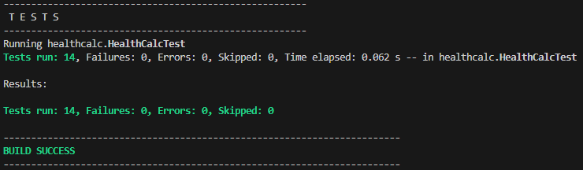

<details open>
  <summary>Práctica 1</summary>

# Introducción

En este proyecto se pretende implementar la funcionalidad de una calculadora de parámetros de salud de una persona. Para ello se seguirá una metodología `TDD` o *Test Driven Development*. Se proporciona una interfaz con los métodos a desarrollar:

* `idealWeight`: tomando la altura y el género como argumentos, esta función calcula el **peso ideal** de una persona.
* `basalMetabolicRate`: tomando el peso, la altura, el género y la edad como argumentos, esta función calcula el **metabolismo basal** de una persona.

# Flujo de trabajo

* A partir de la interfaz con los métodos a desarrollar, **se escriben los casos de prueba** detallados abajo, de forma que la funcionalidad y los posibles errores que puedan surgir a la hora de usar la calculadora queden totalmente cubiertos.
* Siguiendo la metodología TDD, se procede al **desarrollo de los test**, tomando como referencia los casos de prueba.
* Se procede a la **implementación de los métodos**.
* Se comprueba que los **test se pasan con éxito** y se corrige cualquier error estos hayan revelado.

Una vez pasados los tests, se puede comprobar que no hubo ningún error:
```xml
<testsuite xmlns:xsi="http://www.w3.org/2001/XMLSchema-instance" xsi:noNamespaceSchemaLocation="https://maven.apache.org/surefire/maven-surefire-plugin/xsd/surefire-test-report-3.0.xsd" version="3.0" name="healthcalc.HealthCalcTest" time="0.071" tests="14" errors="0" skipped="0" failures="0">
```
El resultado de la consola:
<div style="text-align:center">
  <p align="center">
  
  </p>
</div>

# Casos de prueba

## Método idealWeight
* Comprobar que se lanza una excepción cuando *height* es menor que 84 para hombre
    Explicación: si se iguala la ecuación a cero, los valores por debajo de 83,33 resultarán en un Ideal Weight negativo, lo cual no tiene sentido.
* Comprobar que se lanza una excepción cuando *height* es menor que 67 para mujer
    Explicación: si se iguala la ecuación a cero, los valores por debajo de 66.66 resultarán en un Ideal Weight negativo, lo cual no tiene sentido.
* Comprobar que se lanza una excepción cuando *height* es mayor que 250
    Explicación: se supone que una persona no puede medir mas de 250 cm 
* Comprobar que el resultado es correcto tanto para hombre como para mujer en el intervalo
* Comprobar que se lanza una excepción cuando *gender* no es 'm' o 'w', sin importar mayúsculas o minúsculas

## Método basalMetabolicRate

* Comprobar que se lanza una excepción cuando *weight* está fuera del intervalo (0, 500]
* Comprobar que se lanza una excepción cuando *height* está fuera del intervalo (0, 250]
* Comprobar que se lanza una excepción cuando *gender* no es 'm' o 'w', sin importar mayúsculas o minúsculas
* Comprobar que se lanza una excepción cuando *age* está fuera del intervalo (0, 150]
* Comprobar que se lanza una excepción cuando el resultado de la función es negativo
* Comprobar que el resultado es correcto cuando los parámetros están dentro de rango

# Uso de git y GitHub

Durante el proyecto, se usaron `git` y `GitHub` para el manejo de versiones y almacenamiento del mismo en un repositorio. Se comenzó con un `git fork` desde un repositorio ya creado y una posterior clonación usando `git clone`. Después del desarrollo del proyecto, una visualización del estado usando `gitk --all` se vería de la siguiente manera:

<div style="text-align:center">
  <p align="center">
  
  </p>
</div>

Como se puede observar, es un proyecto sencillo y corto el cual no requiere de un uso complejo de git, por ejemplo con el uso de ramas. Mantener esta simplicidad es esencial para no añadir una complejidad innecesaria. Para más información sobre el uso de git y repositorios remotos, consulte el siguiente [enlace](https://github.com/GonzaloM786/umafactorial).

# Habilidades practicadas

* Uso de git y GitHub.
* Implementación de código eficiente en `java`.
* Implementación de tests con `JUnit` y uso de `Maven`.

</details>

<details open>
  <summary>Práctica 2</summary>

# Introducción

En la segunda parte de este proyecto, se trabajarán fundamentalmente las habilidades para el desarrollo de diagramas de casos de uso. Además, se especificará uno de ellos, incluyendo todas las características necesarias para su descripción.

# Diagrama de casos de uso

En el diagrama de casos de uso se han incluido, además de las funcionalidades que tiene actualmente la calculadora, dos nuevos casos de uso que se describen a continuación:

* __Cálculo del BMI__: el índice de masa corporal de una persona se puede calcular mediante la fórmula BMI = masa / altura^2 (kg/m^2)
* __Cálculo del IMM__: el índice de masa muscular de una persona se puede calcular mediante la fórmula IMM = masa muscular / altura^2 (kg/m^2)


El diagrama muestra los cuatro cálculos que se puede realizar, los cuales generalizan de `Realizar cálculo`. Todos ellos necesitan además la introducción de los parámetros necesarios.

# Especificación de caso de uso

Para la funcionalidad del cálculo del peso ideal, aquí su descripción:

```xml
Especificación de caso de uso
------------------------------------------
Nombre: Cálculo del peso ideal
Actor principal: Usuario
Ámbito: Calculadora de parámetros de salud
Nivel: Summary
Stakeholders e intereses:
	- Usuario: Desea conocer su peso ideal.
	- Desarrollador del software: Asegurarse de que el cálculo se realiza de manera fiable.
Precondiciones: El usuario introduce parámetros validos.
Garantías mínimas: En caso de error, el sistema devuelve un mensaje indicando la causa del mismo.
Garantía de éxito: El sitema muestra el resultado de manera clara y visual.
Trigger: El usuario selecciona la opción del peso ideal.
Escenario princiapl:
1. El usuario selecciona la opción para el cálculo del peso ideal.
2. El usuario introduce los parámetros requeridos.
3. El sistema devuelve el resultado del cálculo.
Escenarios alternativos:
2a. Los parámetros no son validos.
 2a1. El sistema informa al usuario de la no validez de los parámetros y la razón.
 2a2. El sistema pide al usuario que vuelva a introducir los datos erróneos.
 2a3. El usuario puede cancelar el cálculo o volver a intoducir los parámetros.
```
# Habilidades practicadas

* Uso de git y GitHub.
* Creación de diagramas UML (casos de uso).
* Especificación de casos de uso.

</details>

<details open>
  <summary>Práctica 3</summary>
	
# Introducción

La finalidad de esta parte del proyecto es implementar tests de prueba siguiendo la metodología BDD usando Gherkin y Cucumber. Para ello se ha instalado la extensión correspondiente para el entorno de desarrollo utilizado (Visual Studio).

# Historias de usuario

A continuación se definen dos historias de usuario para los dos casos de uso principales definidos en la práctica anterior. Para cada una, se definen varios escenarios que servirán como criterios de aceptación.

```xml
--------------------------
Ideal weight
--------------------------

User Story

As a calculator user
I want to calculate my ideal weight
So that i know the diet i should follow

Acceptance criteria

Scenario: the parameters are correct
Given the height is correct
And the gender is correct
When i press the calculate button
Then the result is returned

Scenario: the gender is not correct
Given the height is correct
And the gender is not correct
When i press the calculate button
Then an error message indicates the gender is not correct

Scenario: the height is not correct
Given the height is not correct
And the gender is correct
When i press the calculate button
Then an error message indicates the height is not correct

--------------------------
Basal metabolic rate
--------------------------

User Story

As a calculator user
I want to calculate my basal metabolic rate
So that i can accurately design my diet

Acceptance criteria

Scenario: the parameters are correct
Given the height, weight, age and gender are correct
When i press the calculate button
Then the result is returned

Scenario: the gender is not correct
Given the height, weight and age are correct
And the gender is not correct
When i press the calculate button
Then an error message indicates the gender is not correct

Scenario: the result is negative
Given the parameters (e.g. height, weight, age and gender)
When i press the calculate button
Then an error message indicates the parameters are not correct
```

# Implementación de los tests

A partir de las historias de usuario, se implementan estas en su correcto formato en ficheros `.feature`. Después, el software debe pasar los tests de manera exitosa. 

# Habilidades practicadas

* Uso de git y GitHub
* Implementación de historias de usuario
* Generación de tests de prueba usando Gherkin y Cucumber

</details>

<details open>
  <summary>Práctica 4: Interfaz gráfica de usuario</summary>

# Introducción

En esta parte de la práctica se pretende implementar una interfaz gráfica de usuario de la calculadora de salud. Para ello se usará `WindowBuilder`, el cual proporiona el diseño de la interfaz. Además se seguirá el modelo-vista-controlador, esencial para implementar IGU que cumplan con los principios de la ingeniería del software.

# Boceto

Para el diseño del boceto se ha utilizado `Pencil`, que es un software gratuito para el diseño de bocetos para IGU. Todo gira alrededor de una única ventana, en la cual de un simple vistazo es fácil reconocer los parámetros necesarios a introducir. 


# Implementación 

Para la implementación, como se ha mencionado anteriormente se ha usado el modelo-vista-controlador:

* __Modelo__: el modelo corresponde a la implementación de la calculadora realizada en prácticas anteriores.
* __Vista__: es la clase que gestiona la interfaz gráfica.
* __Controlador__: hace de intermediario entre el modelo y la vista, interaccionando con ambas.

Para más detalles, se puede ver el código dentro de la carpeta `src`. La implementación final luce de la siguiente manera:


Además, unas ventanas de error aparecen cuando hay algún error en los parámetros que impide que se realice el cálculo. El archivo .jar contiene el programa ejecutable.

# Habilidades practicadas

* Uso de git y GitHub
* Diseño de bocetos
* Uso de WindowBuilder y elementos Swing
* Implementación de interfaces gráficas de usuario siguiendo el modelo-vista-controlador
* Generación de archivos .jar ejecutables

</details>

<details open>
  <summary>Práctica 6: Patrones de diseño</summary>

# Introducción

En este apartado, se simulará la integración de la calculadora en el `Hospital Costa del Sol`, de donde se ha pedido la adaptación de la misma a las nuevas condiciones y la implementación de nuevas funcionalidades. En los siguientes apartados, se discutirá el patrón de diseño empleado en cada caso además del diagrama UML correspondiente. Para ver detalles específicos de la implementación, se puede consultar el código dentro de la carpeta `src`.

# Cuestiones

## Aplicación del Singleton

Este patrón de diseño se asegura de que solo exista una única instancia de la clase en cuestión. Al contener la clase `HealthCalcImpl` únicamente dos métodos, no tiene sentido usar crear distintas instancias de la clase.


## Adaptación a la nueva interfaz del hospital

El hospital ha pedido al equipo de desarrollo reutilizar la implementación existente de la calculadora para adaptarla a la nueva interfaz `HealthHospital`. Para ello se ha usado el patrón **Adapter**, el cual crea una clase que implementa la nueva interfaz, y a la vez usa una instacia de una clase que implementa la interfaz antigua. De esta manera, se adapta la funcionalidad para cumplimentar con los requisitos del hospital sin perder la antigua implementación.


## Sistema de logging

Desde el hospital se ha pedido además que se lleve un registro de los datos, tanto de entrada como de salida, que se usan en la calculadora de acuerdo con la interfaz `HealthStats`. El patrón ideal es el **proxy**, ya que permitirá hacer el registro mientras se delega el cálculo a una clase que implemente la calculadora. El proxy contiene una referencia a una calculadora, encargada del cálculo, y el resto de funciones necesarias para el logging.


## Versiones según la región

Por último, se pide hacer dos versiones de la calculadora, una europea y otra americana. La diferencia radica en las unidades que toma de entrada. Para el cálculo del `bmr`, además debe imprimir por pantalla un mensaje, tanto en inglés como en español, donde se indique claramente el resultado de la operación, para ambas versiones. Para ello se ha usado un **decorador**, el cual hereda a dos clases, una para cada versión. Estas clases hijas son las encargadas de hacer adaptar el cálculo a las nuevas unidades y en caso necesario imprimir por pantalla. Además, para no perder las funionalidades anteriores, la referencia de la clase padre a la calculadora, es la implementada en el proxy.


# Habilidades practicadas

* Uso de git y GitHub
* Uso de patrones de diseño
* Creación de diagramas de clases UML

</details>

<details open>
  <summary>Práctica 7: Refactorings</summary>


# Introducción

Tomando como referencia el código correspondiente a la rama `practica6`, en esta práctica se hará una refactorización de todo el código, con el objetivo de hacer este más legible y aplicar buenas técnicas de programación. A continuación se muestran los distintos `bad smell` localizados y la manera en la que se han resuelto.

# Refactorización


>> Bad smell: large class
>>
>> Refactoring applied and its type: extract class (class refactoring)
>>
>> Changes: the HealthCalcImpl class has been divided into two classes, one for the cardiovascular metrics and another for the metabolic metrics. This makes the code opened for extension.
>>
>> Number of manual changes: 2 new classes. 
>
>> Bad smell: long parameter list and magic numbers (gender not as enum).
>> 
>> Refactoring applied and its type: introduce parameter object (method refactoring), extract class (class refactoring).
>> 
>> NOTE: in order to not change the interface provided by the hospital (refactoring this would mean to not adapt to the client's conditions), the HealthHosptial interface was
>> not changed, as well as the input of the rest of the classes that use it (adapter, proxy and decorators). However, the HospitalAdapter class uses the two new classes,
>> CardiovascularMetrics and MetabolicMetrics, which do implement the new changes, e.g. taking a Persona object instead of a long list of parameters.
>> 
>> Changes: Gender enum and Persona class (extending from Person interface) have been created. Classes CardiovascularMetrics and MetabolicMetrics now take a Persona object as an argument.
>> Class HealthHospital and GUI use the new classes. Tests have been changed to check the new classes.
>>
>> Number of manual changes: 1 new enum, 1 new interface, 1 new class; 5 classes modified and tests changed.
>
>> Bad smell: dead code
>> 
>> Refactoring applied and its type: remove unused code (method refactoring)
>> 
>> Changes: in the child classes CalculadoraEuropea and CalculadoraAmericana the methods that were just calling the parent class have been deleted. The functionality has been maintained
>> since the parent class is the one which implements the functionality.
>> 
>> Number of manual changes: 2 blocks of code deleted. 
>
>> Bad smell: dead code
>> 
>> Refactoring applied and its type: remove unused code (class refactoring)
>> 
>> Changes: due to the refactorings applied before, the interface HealthCalc and the class HealthCalcImpl are no longer used, therefore they have been deleted.
>> 
>> Number of manual changes: 1 interface and 1 class deleted. 


# Conclusión

Resumiendo, los cambios principales que se han hecho durante la refactorización, han sido la creación de una clase persona, que toma un tipo enum como género. Además la clase HealthCalcImpl se ha divido en dos por cuestiones semánticas. Por último se han borrado aquellas partes no necesarias del código, haciendolo más legible y mantenible sin cambiar la funcionalidad.

# Habilidades practicadas

* Uso de git y GitHub
* Aplicación de técnicas de refactorización
* Documentación usando vocabulario específico

</details>
