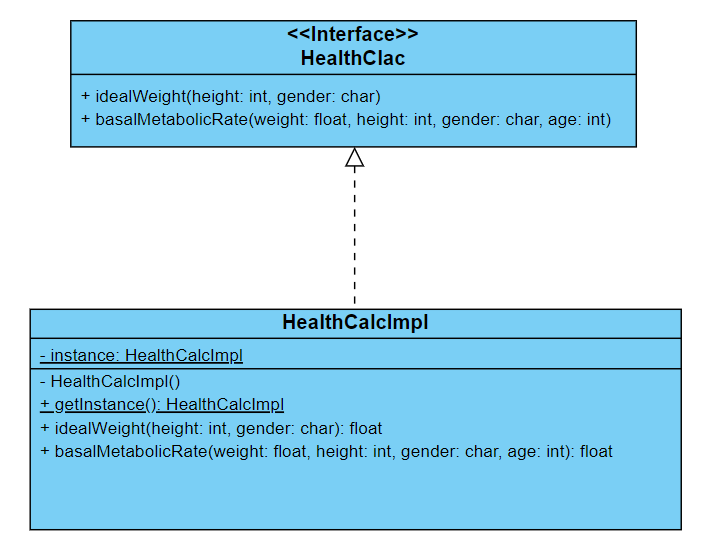
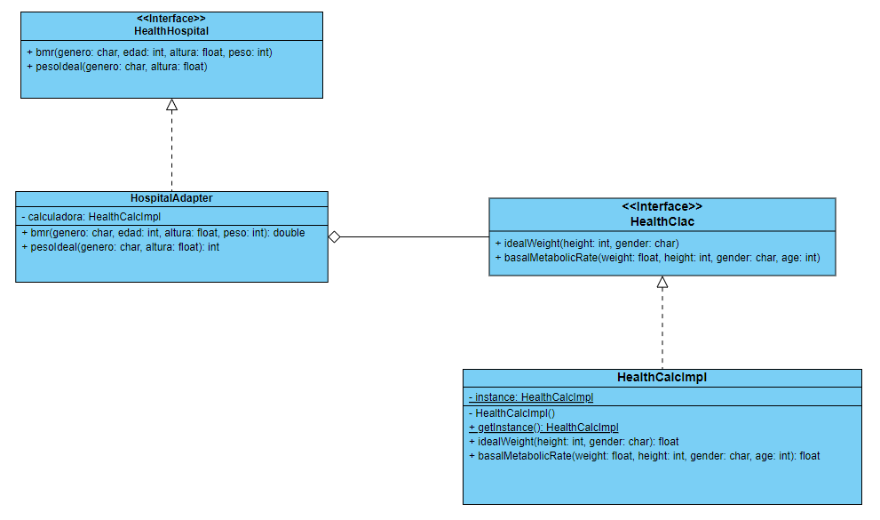
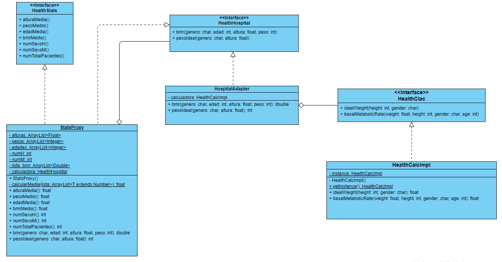
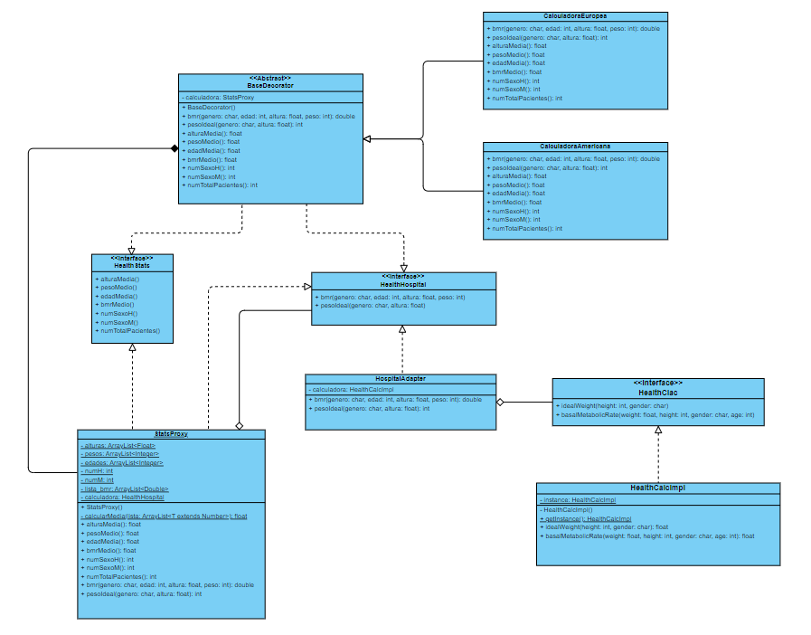

# Práctica 6: Patrones de diseño

## Introducción

En este apartado, se simulará la integración de la calculadora en el `Hospital Costa del Sol`, de donde se ha pedido la adaptación de la misma a las nuevas condiciones y la implementación de nuevas funcionalidades. En los siguientes apartados, se discutirá el patrón de diseño empleado en cada caso además del diagrama UML correspondiente. Para ver detalles específicos de la implementación, se puede consultar el código dentro de la carpeta `src`.

## Cuestiones

### Aplicación del Singleton

Este patrón de diseño se asegura de que solo exista una única instancia de la clase en cuestión. Al contener la clase `HealthCalcImpl` únicamente dos métodos, no tiene sentido usar crear distintas instancias de la clase.

  

  
  

### Adaptación a la nueva interfaz del hospital

El hospital ha pedido al equipo de desarrollo reutilizar la implementación existente de la calculadora para adaptarla a la nueva interfaz `HealthHospital`. Para ello se ha usado el patrón **Adapter**, el cual crea una clase que implementa la nueva interfaz, y a la vez usa una instacia de una clase que implementa la interfaz antigua. De esta manera, se adapta la funcionalidad para cumplimentar con los requisitos del hospital sin perder la antigua implementación.

  

  
  

### Sistema de logging

Desde el hospital se ha pedido además que se lleve un registro de los datos, tanto de entrada como de salida, que se usan en la calculadora de acuerdo con la interfaz `HealthStats`. El patrón ideal es el **proxy**, ya que permitirá hacer el registro mientras se delega el cálculo a una clase que implemente la calculadora. El proxy contiene una referencia a una calculadora, encargada del cálculo, y el resto de funciones necesarias para el logging.

  

  
  

### Versiones según la región

Por último, se pide hacer dos versiones de la calculadora, una europea y otra americana. La diferencia radica en las unidades que toma de entrada. Para el cálculo del `bmr`, además debe imprimir por pantalla un mensaje, tanto en inglés como en español, donde se indique claramente el resultado de la operación, para ambas versiones. Para ello se ha usado un **decorador**, el cual hereda a dos clases, una para cada versión. Estas clases hijas son las encargadas de hacer adaptar el cálculo a las nuevas unidades y en caso necesario imprimir por pantalla. Además, para no perder las funionalidades anteriores, la referencia de la clase padre a la calculadora, es la implementada en el proxy.

  

  
  

## Habilidades practicadas

* Uso de git y GitHub
* Uso de patrones de diseño
* Creación de diagramas de clases UML
