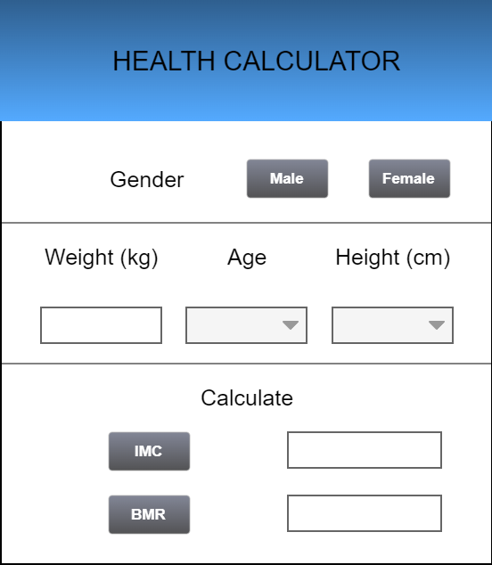
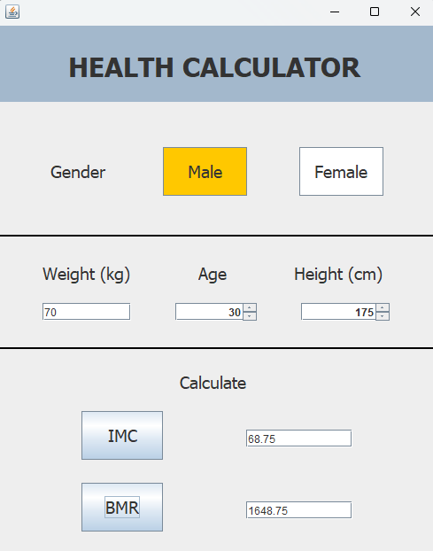

# Práctica 4: Interfaz gráfica de usuario

## Introducción

En esta parte de la práctica se pretende implementar una interfaz gráfica de usuario de la calculadora de salud. Para ello se usará `WindowBuilder`, el cual proporiona el diseño de la interfaz. Además se seguirá el modelo-vista-controlador, esencial para implementar IGU que cumplan con los principios de la ingeniería del software.

## Boceto

Para el diseño del boceto se ha utilizado `Pencil`, que es un software gratuito para el diseño de bocetos para IGU. Todo gira alrededor de una única ventana, en la cual de un simple vistazo es fácil reconocer los parámetros necesarios a introducir. 

  

  
  

## Implementación 

Para la implementación, como se ha mencionado anteriormente se ha usado el modelo-vista-controlador:

* __Modelo__: el modelo corresponde a la implementación de la calculadora realizada en prácticas anteriores.
* __Vista__: es la clase que gestiona la interfaz gráfica.
* __Controlador__: hace de intermediario entre el modelo y la vista, interaccionando con ambas.

Para más detalles, se puede ver el código dentro de la carpeta `src`. La implementación final luce de la siguiente manera:

  

  
  

Además, unas ventanas de error aparecen cuando hay algún error en los parámetros que impide que se realice el cálculo. El archivo .jar contiene el programa ejecutable.

## Habilidades practicadas

* Uso de git y GitHub
* Diseño de bocetos
* Uso de WindowBuilder y elementos Swing
* Implementación de interfaces gráficas de usuario siguiendo el modelo-vista-controlador
* Generación de archivos .jar ejecutables
