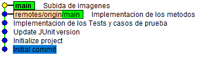

<details open>
  <summary>Práctica 1</summary>

# Introducción

En este proyecto se pretende implementar la funcionalidad de una calculadora de parámetros de salud de una persona. Para ello se seguirá una metodología `TDD` o *Test Driven Development*. Se proporciona una interfaz con los métodos a desarrollar:

* `idealWeight`: tomando la altura y el género como argumentos, esta función calcula el **peso ideal** de una persona.
* `basalMetabolicRate`: tomando el peso, la altura, el género y la edad como argumentos, esta función calcula el **metabolismo basal** de una persona.

# Flujo de trabajo

* A partir de la interfaz con los métodos a desarrollar, **se escriben los casos de prueba** detallados abajo, de forma que la funcionalidad y los posibles errores que puedan surgir a la hora de usar la calculadora queden totalmente cubiertos.
* Siguiendo la metodología TDD, se procede al **desarrollo de los test**, tomando como referencia los casos de prueba.
* Se procede a la **implementación de los métodos**.
* Se comprueba que los **test se pasan con éxito** y se corrige cualquier error estos hayan revelado.

Una vez pasados los tests, se puede comprobar que no hubo ningún error:
```xml
<testsuite xmlns:xsi="http://www.w3.org/2001/XMLSchema-instance" xsi:noNamespaceSchemaLocation="https://maven.apache.org/surefire/maven-surefire-plugin/xsd/surefire-test-report-3.0.xsd" version="3.0" name="healthcalc.HealthCalcTest" time="0.071" tests="14" errors="0" skipped="0" failures="0">
```
El resultado de la consola:
<div style="text-align:center">
  <p align="center">
  
  </p>
</div>

# Casos de prueba

## Método idealWeight
* Comprobar que se lanza una excepción cuando *height* es menor que 84 para hombre
    Explicación: si se iguala la ecuación a cero, los valores por debajo de 83,33 resultarán en un Ideal Weight negativo, lo cual no tiene sentido.
* Comprobar que se lanza una excepción cuando *height* es menor que 67 para mujer
    Explicación: si se iguala la ecuación a cero, los valores por debajo de 66.66 resultarán en un Ideal Weight negativo, lo cual no tiene sentido.
* Comprobar que se lanza una excepción cuando *height* es mayor que 250
    Explicación: se supone que una persona no puede medir mas de 250 cm 
* Comprobar que el resultado es correcto tanto para hombre como para mujer en el intervalo
* Comprobar que se lanza una excepción cuando *gender* no es 'm' o 'w', sin importar mayúsculas o minúsculas

## Método basalMetabolicRate

* Comprobar que se lanza una excepción cuando *weight* está fuera del intervalo (0, 500]
* Comprobar que se lanza una excepción cuando *height* está fuera del intervalo (0, 250]
* Comprobar que se lanza una excepción cuando *gender* no es 'm' o 'w', sin importar mayúsculas o minúsculas
* Comprobar que se lanza una excepción cuando *age* está fuera del intervalo (0, 150]
* Comprobar que se lanza una excepción cuando el resultado de la función es negativo
* Comprobar que el resultado es correcto cuando los parámetros están dentro de rango

# Uso de git y GitHub

Durante el proyecto, se usaron `git` y `GitHub` para el manejo de versiones y almacenamiento del mismo en un repositorio. Se comenzó con un `git fork` desde un repositorio ya creado y una posterior clonación usando `git clone`. Después del desarrollo del proyecto, una visualización del estado usando `gitk --all` se vería de la siguiente manera:

<div style="text-align:center">
  <p align="center">
  
  </p>
</div>

Como se puede observar, es un proyecto sencillo y corto el cual no requiere de un uso complejo de git, por ejemplo con el uso de ramas. Mantener esta simplicidad es esencial para no añadir una complejidad innecesaria. Para más información sobre el uso de git y repositorios remotos, consulte el siguiente [enlace](https://github.com/GonzaloM786/umafactorial).

# Habilidades practicadas

* Uso de git y GitHub.
* Implementación de código eficiente en `java`.
* Implementación de tests con `JUnit` y uso de `Maven`.

</details>

<details open>
  <summary>Práctica 2</summary>

# Introducción

En la segunda parte de este proyecto, se trabajarán fundamentalmente las habilidades para el desarrollo de diagramas de casos de uso. Además, se especificará uno de ellos, incluyendo todas las características necesarias para su descripción.

# Diagrama de casos de uso

En el diagrama de casos de uso se han incluido, además de las funcionalidades que tiene actualmente la calculadora, dos nuevos casos de uso que se describen a continuación:

* __Cálculo del BMI__: el índice de masa corporal de una persona se puede calcular mediante la fórmula BMI = masa / altura^2 (kg/m^2)
* __Cálculo del IMM__: el índice de masa muscular de una persona se puede calcular mediante la fórmula IMM = masa muscular / altura^2 (kg/m^2)


El diagrama muestra los cuatro cálculos que se puede realizar, los cuales generalizan de `Realizar cálculo`. Todos ellos necesitan además la introducción de los parámetros necesarios.

# Especificación de caso de uso

Para la funcionalidad del cálculo del peso ideal, aquí su descripción:

```xml
Especificación de caso de uso
------------------------------------------
Nombre: Cálculo del peso ideal
Actor principal: Usuario
Ámbito: Calculadora de parámetros de salud
Nivel: Summary
Stakeholders e intereses:
	- Usuario: Desea conocer su peso ideal.
	- Desarrollador del software: Asegurarse de que el cálculo se realiza de manera fiable.
Precondiciones: El usuario introduce parámetros validos.
Garantías mínimas: En caso de error, el sistema devuelve un mensaje indicando la causa del mismo.
Garantía de éxito: El sitema muestra el resultado de manera clara y visual.
Trigger: El usuario selecciona la opción del peso ideal.
Escenario princiapl:
1. El usuario selecciona la opción para el cálculo del peso ideal.
2. El usuario introduce los parámetros requeridos.
3. El sistema devuelve el resultado del cálculo.
Escenarios alternativos:
2a. Los parámetros no son validos.
 2a1. El sistema informa al usuario de la no validez de los parámetros y la razón.
 2a2. El sistema pide al usuario que vuelva a introducir los datos erróneos.
 2a3. El usuario puede cancelar el cálculo o volver a intoducir los parámetros.
```
# Habilidades practicadas

* Uso de git y GitHub.
* Creación de diagramas UML (casos de uso).
* Especificación de casos de uso.


</details>
